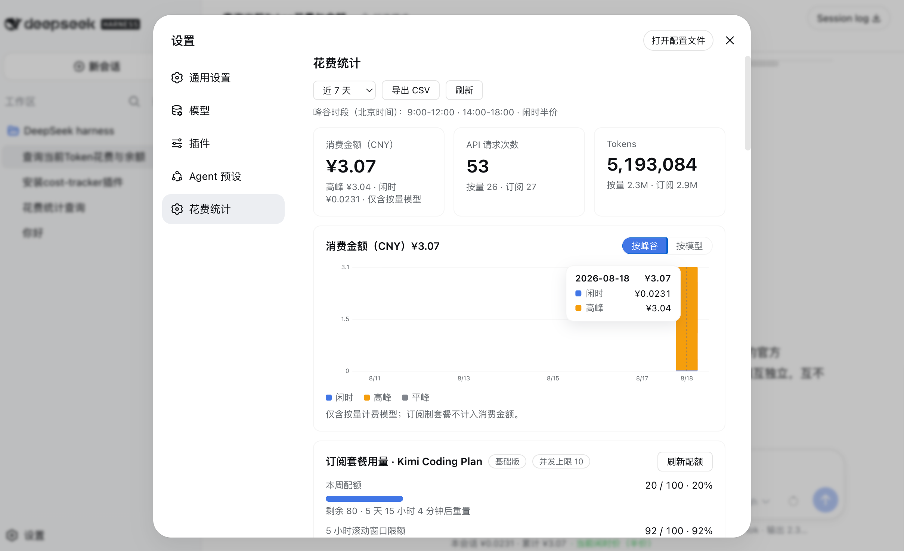
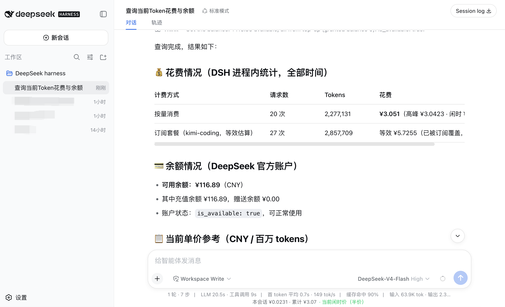
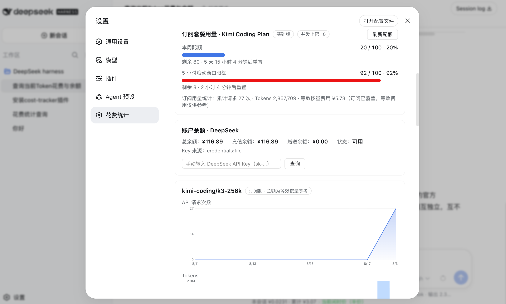
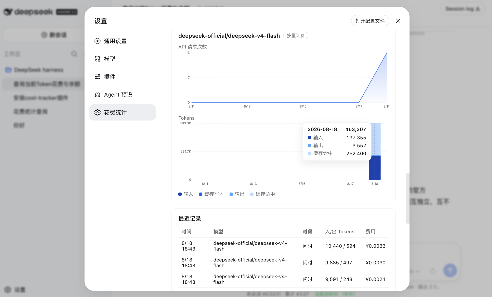

<div align="center">

#  DSH Cost Tracker

**LLM COST & USAGE TRACKING PLUGIN FOR DEEPSEEK HARNESS**

[简体中文](./README.md) | **English**


[](https://github.com/Angelyeye/dsh-cost-tracker/stargazers)

</div>

---

> An LLM cost-tracking plugin for [DeepSeek Harness](https://github.com/deepseek-ai/dsh): automatically records token usage and cost (CNY) for every API call, with **native support for DeepSeek's official peak/off-peak pricing (half-price off-peak) and Kimi Coding Plan subscription usage & equivalent-cost statistics**. Visual settings dashboard with hover tooltips, in-chat agent queries, balance & quota monitoring — all persisted locally, survives restarts, and uninstalls cleanly.

> 一个为 [DeepSeek Harness](https://github.com/deepseek-ai/dsh) 打造的 LLM 花费统计插件:自动记录每一次 API 调用的 Token 用量与费用,**原生支持 DeepSeek 官方峰值价格计费与 Kimi Coding Plan 订阅套餐的用量及等效费用统计**。设置页可视化仪表盘、对话内 Agent 查询、账户余额与订阅配额监控,数据全部本地持久化。



---

## Features

| | Feature | Description |
| --- | --- | --- |
| 💰 | **Cost tracking** | Every API call is recorded automatically: input / output / cache-hit / cache-write tokens and cost, aggregated by day and by model |
| ⏰ | **Peak/off-peak pricing** | Built-in price table; peak windows (9:00–12:00, 14:00–18:00 Beijing time) vs half-price off-peak are handled automatically; local models (e.g. ollama) count as 0 |
| 📊 | **Visual dashboard** | A new "Cost Statistics" page in Settings: overview cards, cost bar charts (by peak period / by model), per-model request & token charts — **all with hover tooltips** |
| 📈 | **Subscription quota** | Kimi Coding Plan and similar subscriptions: weekly quota, 5-hour rolling window limit, pay-as-you-go-equivalent cost for reference |
| 💳 | **Balance lookup** | One-click DeepSeek account balance (total / topped-up / granted / status) |
| 🤖 | **Agent tools** | Ask in any chat: "how much have I spent today?" — the agent answers via `cost_stats` / `cost_prices` |
| 🔻 | **Status line** | A live line under the chat input: session cost, total cost, current peak/off-peak price indicator |
| 💾 | **Local persistence** | Data lives in `~/.dsh/storages/cost-tracker-records.json`; survives restarts, never leaves your machine |
| 📤 | **CSV export** | Export all records in one click for further analysis in Excel / Numbers |

## Screenshots

**Ask the agent directly** — built-in cost/balance/price tools with a live status line under the input box:



**Subscription quota & account balance** — progress bars, reset countdowns and balance at a glance:



**Per-model details** — request trends and token composition per model, with hover tooltips:



---

## Installation (choose one)

> Prerequisite: you already run DSH in web mode (`dsh web`). `~/.dsh` below means the DSH home directory (`${DSH_HOME:-$HOME/.dsh}`).

### Option A: Let DSH install it for you (recommended, no CLI knowledge needed)

Open any DSH session and paste this prompt verbatim to the agent:

```
Please install the DSH plugin dsh-cost-tracker for me:
1. git clone https://github.com/Angelyeye/dsh-cost-tracker.git into ~/.dsh/profiles/node_modules/dsh-cost-tracker (the directory MUST be named dsh-cost-tracker)
2. Append to the top-level array of ~/.dsh/profiles/web/cordis.patch.yml:
   - insert:
       - id: cost-tracker
         name: dsh-cost-tracker
3. Tell me when done — I will restart dsh web myself
```

Then stop `dsh web` with `Ctrl+C`, start it again, and refresh your browser.

### Option B: Manual install (3 commands)

```bash
# 1. Download the plugin (directory name must match the package name)
mkdir -p ~/.dsh/profiles/node_modules
git clone https://github.com/Angelyeye/dsh-cost-tracker.git ~/.dsh/profiles/node_modules/dsh-cost-tracker

# 2. Register the plugin (append to the patch file)
cat >> ~/.dsh/profiles/web/cordis.patch.yml <<'EOF'
- insert:
    - id: cost-tracker
      name: dsh-cost-tracker
EOF

# 3. Restart DSH (Ctrl+C the running dsh web first)
dsh web
```

### Verify it works

1. Open the DSH Web GUI → **Settings** (bottom-left) → a **"Cost Statistics"** entry appears in the sidebar;
2. A cost status line shows up under the chat input;
3. Ask the agent "check my current spending" — a correct answer means everything is ready.

> ⚠️ If `~/.dsh/profiles/web/cordis.patch.yml` already contains entries, keep them and only append the block above; the file's top level must remain a YAML array.

---

## Usage

### The Settings dashboard

- **Time range**: switch between last 7 days / 30 days / all time (top-right);
- **Cost chart**: segment by peak period or by model; hover for daily breakdowns;
- **Per-model sections**: one request-count chart and one token-composition chart (input / cache write / output / cache hit) per model;
- **CSV export**: export all records within the selected range.

### Agent tools

| Tool | Purpose | Example prompt |
| --- | --- | --- |
| `cost_stats` | Query usage & cost statistics | "How much did I spend today?" |
| `cost_prices` | Show the built-in price table & peak rules | "What does deepseek-v4-flash cost right now?" |
| `cost_reset` | **Erase ALL statistics (irreversible)** | "Reset my cost statistics" |

### HTTP API (for other tools)

All endpoints are `POST` + JSON and listen on the loopback address:

```
POST /api/cost-tracker/summary      Overview
POST /api/cost-tracker/dashboard    Dashboard data
POST /api/cost-tracker/kimi-usage   Kimi subscription quota
POST /api/cost-tracker/balance      Account balance
POST /api/cost-tracker/prices       Price table
POST /api/cost-tracker/export       CSV export
```

Example: `curl -X POST http://127.0.0.1:3080/api/cost-tracker/summary -d '{}'`

---

## FAQ

**Q: Where is my data? Is it safe?**
Everything stays on your machine in `~/.dsh/storages/cost-tracker-records.json`; nothing is uploaded. The API binds to loopback but has no authentication — **do not expose the DSH port to the public internet**.

**Q: Do I lose data when DSH restarts?**
No. Records are flushed to disk with debounced atomic writes (capped at 5000 entries) and restored on startup. A corrupted file is backed up as `.corrupt-<timestamp>` and tracking restarts cleanly.

**Q: What does "equivalent cost" mean for subscription models (kimi-coding)?**
Subscriptions are not billed per token. The plugin estimates what those calls *would* cost at pay-as-you-go prices so you can judge whether your subscription pays off — **it is not a real charge**.

**Q: The amounts don't exactly match my official bill?**
Costs are estimated locally from a built-in price table and may differ slightly from the official bill (price updates, tiered pricing, etc.). Treat official billing as authoritative; the balance shown is fetched live from the official API.

**Q: How do I uninstall?**
1. Open `~/.dsh/profiles/web/cordis.patch.yml` and remove the 4-line `- insert:` block for `cost-tracker` (or ask the DSH agent to do it);
2. Restart `dsh web`;
3. Optionally delete `~/.dsh/profiles/node_modules/dsh-cost-tracker` and `~/.dsh/storages/cost-tracker-records.json`.

**Q: How do I update the plugin?**
Run `git pull` inside the plugin directory. If only the UI (`client.js`) changed, a **hard browser refresh** (Cmd/Ctrl+Shift+R) is enough; if `index.js` changed, restart `dsh web`.

## Repository layout

```
├── index.js        Host half: usage capture, aggregation, persistence, HTTP API, agent tools
├── client.js       Client half: settings dashboard & status line UI
├── package.json    Plugin manifest (with dsh.client declaration)
└── docs/           README screenshots
```

## License

[MIT](./LICENSE) · Issues and PRs welcome
